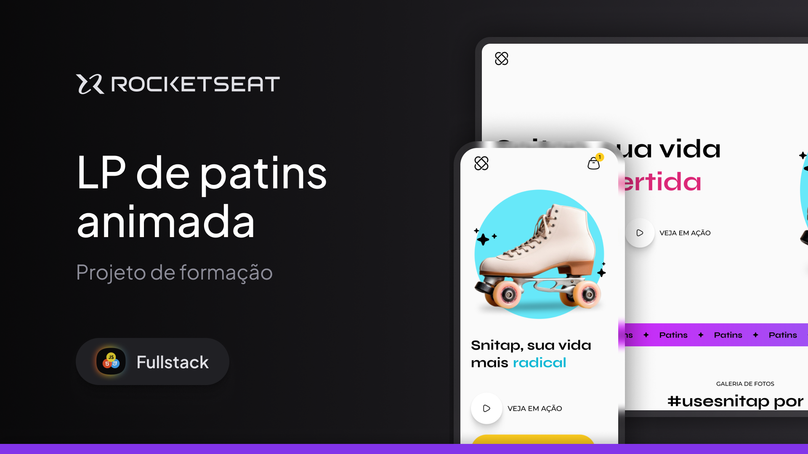

# --Snitap - Patins

Uma landing page vibrante e dinâmica desenvolvida para uma marca de patins, focada em transmitir energia, movimento e um estilo de vida radical. O projeto destaca o produto através de animações fluidas e um design visualmente rico.

## 📸 Preview



## 🌟 Destaques do Projeto
Hero Section Dinâmica: Apresenta um título com efeito de "máquina de escrever" vertical (via CSS Keyframes) que alterna entre as palavras radical, saudável e divertida.

Animações de Entrada: Uso estratégico de keyframes para fazer o produto (patins) e elementos decorativos (estrelas e elipses) deslizarem para a tela assim que a página carrega.

Banner Scroller Infinito: Um banner horizontal com animação contínua (marquee) que reforça a identidade visual da marca.

Galeria de Fotos Interativa: * Layout em grid responsivo.

Efeito de Hover que revela o nome do usuário do Instagram e dá zoom na imagem.

Animações de surgimento baseadas no scroll do usuário (animation-timeline: view()).

Design Responsivo: Totalmente adaptado para dispositivos móveis, garantindo uma experiência fluida em telas pequenas.

## 🛠️ Tecnologias e Técnicas
HTML5 Semântico: Uso de tags como figure, figcaption, section, header e footer.

CSS Moderno (Nesting & Variables): * Utilização de variáveis CSS para paleta de cores (--snitap-sun, --snitap-sky-mid, etc).

Aninhamento de seletores (CSS Nesting) para um código mais limpo e organizado.

Scroll-driven Animations: Implementação de animações que reagem ao rolar da página.

Flexbox & CSS Grid: Combinação de técnicas de layout para posicionamento preciso de elementos e galerias complexas.

Google Fonts: Integração das fontes Syne (para títulos impactantes) e Montserrat (para legibilidade).

## ▶️ Como executar

```bash
# Clone o repositório
git clone https://github.com/seu-usuario/seu-repo

# Entre na pasta
cd seu-repo

# Abra o index.html

## 👤 Autor

- Jouberth Alves Macedo